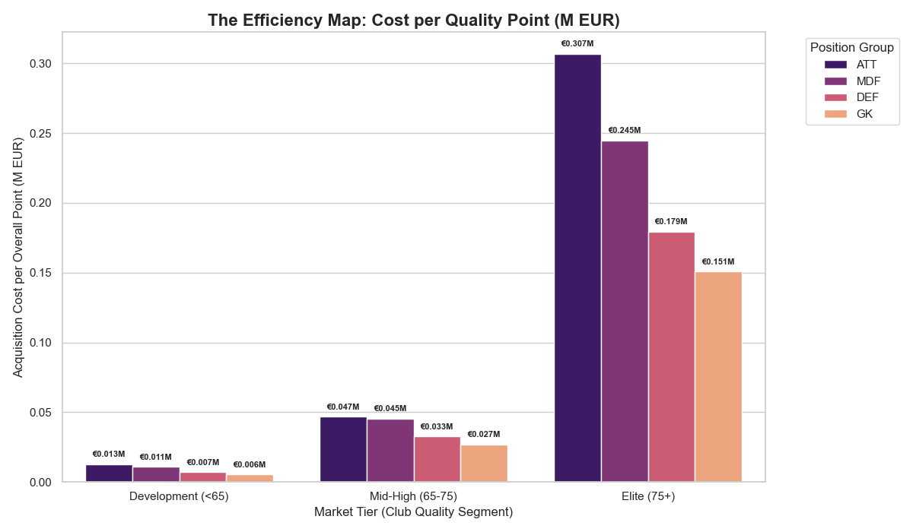
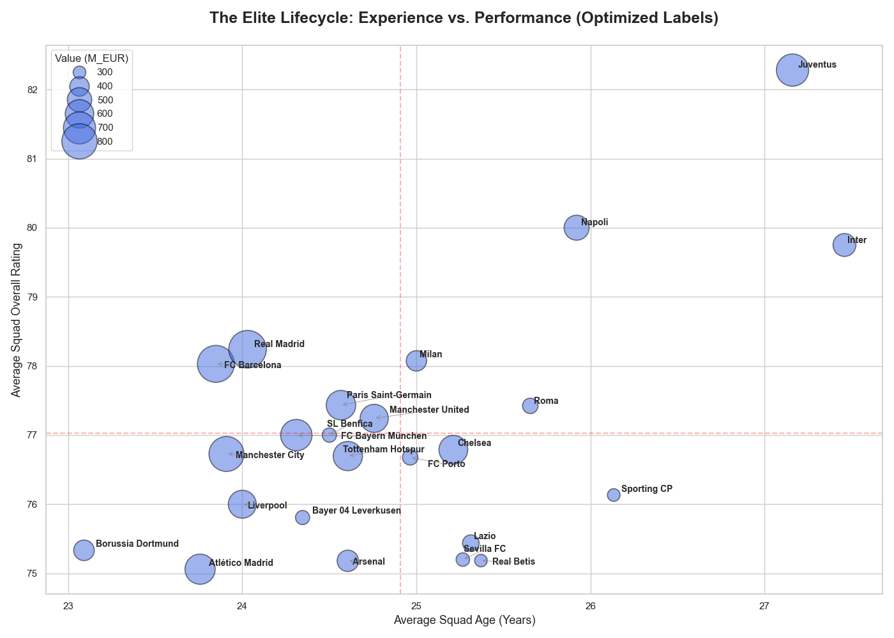
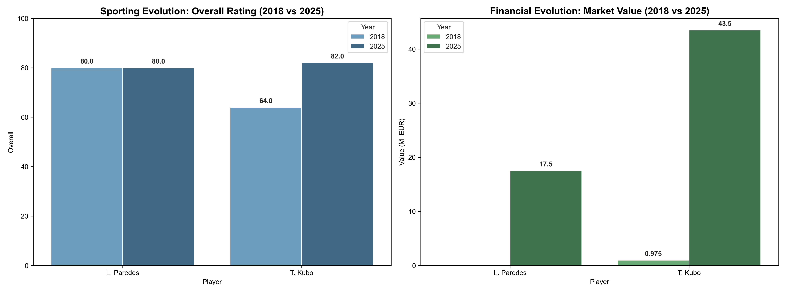

# Strategic Football Analytics: Data-Driven Scouting & Market Intelligence

 
 


## :clipboard: Executive Summary
This project provides a comprehensive strategic framework for professional football club management. Utilizing FIFA 18 (videogame) data, we developed a modular pipeline to move from raw data exploration to high-level market consultancy. The project addresses critical challenges in modern recruitment, such as identifying undervalued talent, managing squad aging cycles, and navigating positional inflation.

---

## :open_file_folder: Project Structure
The repository is organized following professional data science standards for modularity and reproducibility:

```text
├── data/
│   ├── raw/                # Original FIFA dataset
│   └── processed/          # Cleaned data (fifa_processed.csv and scouting_results.csv)
├── notebooks/
│   ├── 01_exploration.ipynb # Initial data audit & discovery
│   ├── 02_cleaning.ipynb    # ETL pipeline & data transformations
│   └── 03_analysis.ipynb    # Strategic insights & visualizations
├── src/
│   ├── transformations.py   # Cleaning data functions
│   └── analysis_utils.py    # Club filtering and quality tiering logic
├── outputs/
│   ├── figures/            # Saved PNG visualizations
│   └── reports/            # Exported Excel or CSV scouting lists
└── requirements.txt        # Project dependencies
```


---


## :wrench: Technical Methodology

### 1. The ETL Pipeline (`transformations.py`)
Raw data was transformed into actionable intelligence through a robust cleaning pipeline:
* **Unit Conversion:** Standardized Imperial units (lbs, ft'in) to Metric (kg, cm).
* **Currency Normalization:** Developed a Regex-based parser to convert complex string values (e.g., `€10.5M`, `€100K`) into standardized floats for financial modeling.
* **Positional Grouping:** Consolidated 27 specific FIFA positions into 4 strategic categories: **GK, DEF, MDF, ATT**.
* **Missing treatment:** Developed a missing values treatment by dropping or filling those values in the best way possible.

### 2. Strategic Quality Tiering (`analysis_utils.py`)
To ensure meaningful comparisons, we developed a `club_filtering` utility. This allows us to segment the market by **Mean Club Overall Quality**, distinguishing between "Elite," "Mid-Tier," and "Growth" clubs to identify the most efficient investment pockets.


---


## :chart_with_upwards_trend: Strategic Results & Market Insights

### **The "Attacker Tax" & Positional Scarcity**
Our economic analysis identified a significant "Attacker Tax". For the same unit of "Overall" quality, attackers command a much higher market value and wage premium compared to defensive players. 

* **Insight:** The Mid-High (65-75) quality tier was identified as the most "rational" market, offering the best balance between performance and acquisition cost before exponential inflation occurs in the Elite bracket.

> 


### **Club Diagnostics: The Elite Lifecycle**
By mapping squad maturity against average performance, we identified clubs at risk of imminent asset depreciation. 
* **Veteran Powerhouses:** Clubs like Juventus and Inter were identified as having squads at the "peak" of their careers (>26-27 years old), requiring urgent renovation strategies.
* **Consolidated Dynasties:** Real Madrid and Barcelona were highlighted for maintaining elite performance while successfully integrating younger talent (<24.5 years old).

> 


---


## :dart: Predictive Validation (Backtesting)
We validated our 2018 scouting model against 2025 reality to demonstrate its predictive power:

| Player | 2018 Status (Scouted) | 2025 Reality | Result |
| :--- | :--- | :--- | :--- |
| **Takefusa Kubo** | 64 Overall / €0.975M Value | 82 Overall / €43.5M Value | **Success: +4,400% Financial ROI** |
| **Leandro Paredes**| 80 Overall / Free Agent | 80 Overall / €17.5M Value | **Success: Immediate Stability** |

> 


---


## :rocket: Installation & Usage

Follow this stepts to set up your environment and execute the analysis in your local machine:

### 1. Prerequisites
Ensure you have **Python 3.8 or superior** installed. It is not mandatory the usage of a virtual environment, but it is recommended to keep dependencies clean.

### 2. Clone the repository
Copy the project into your local directory using Git:
```bash
git clone https://github.com/dalarconro/FIFA18_Python_Analysis.git
cd FIFA18_Python_Analysis
```

### 3. Installation of dependencies
Install all necessary libraries (Pandas, Numpy, Matplotlib, Seaborn, etc.) executing the following command in your terminal:

```bash
pip install -r requirements.txt
```

### 4. Project Execution
To reproduce the results and generate the reports, open and execute the notebooks in the Data Pipeline locic order:

* **notebooks/01_exploration.ipynb:** Initial exploration and FIFA 18 dataset structure discovery.

* **notebooks/02_cleaning.ipynb:** ETL pipeline execution.

* **notebooks/03_analysis.ipynb:** Strategic visualization generation, inflation analysis and scouting final results.


### 5. Project Outputs
After executing the notebooks, you will be able to find the results in the follofing folders:

* **outputs/figures/:** exported graphics (Efficiency map, Elite Lifecycle, etc.).

* **outputs/reports/:** Scouting lists and investment opportunities in CSV or XLSX formats.


---


## :bulb: Conclusion and Strategic Vision

This comprehensive analysis has moved from raw data processing to high-level strategic consultancy. By synthesizing scouting, club diagnostics, and market economics, we have established a robust framework for professional football management:

1. **Talent Discovery (Scouting):** We proved that data-driven filters can distinguish between "Low-Risk Performance" (like Paredes) and "High-Reward Potential" (like Kubo), allowing a club to balance immediate results with future financial growth.

2. **Organizational Health (Club Analysis):** By diagnosing "Aging Squads," we identified exactly where clubs are vulnerable to asset depreciation, providing a clear "Rejuvenation Roadmap" for teams at risk.

3. **Market Intelligence (Inflation & Scarcity):** We quantified the "Attacker Tax" and identified the Mid-High (65-75) tier as the most efficient market for acquisition, allowing clubs to bypass the exponential inflation of the elite bracket.

4. **Strategic Backtesting:** The 2025 validation confirms that our 2018 metrics weren't just snapshots—they were predictive indicators of professional success.

**Final Insight:** In modern football, the competitive gap is often a financial gap. However, as this project demonstrates, data is the great equalizer. By understanding positional scarcity and identifying quality before the market inflates its price, a club can overperform its budget and build a sustainable, winning dynasty.

---

## 👤 Personal Information

* **Name:** Diego Alarcón Rodríguez
* **Role:** Computer Engineer & Data Analyst
* **LinkedIn:** https://www.linkedin.com/in/diego-alarcon-rodriguez/
* **Portfolio:** https://github.com/dalarconro